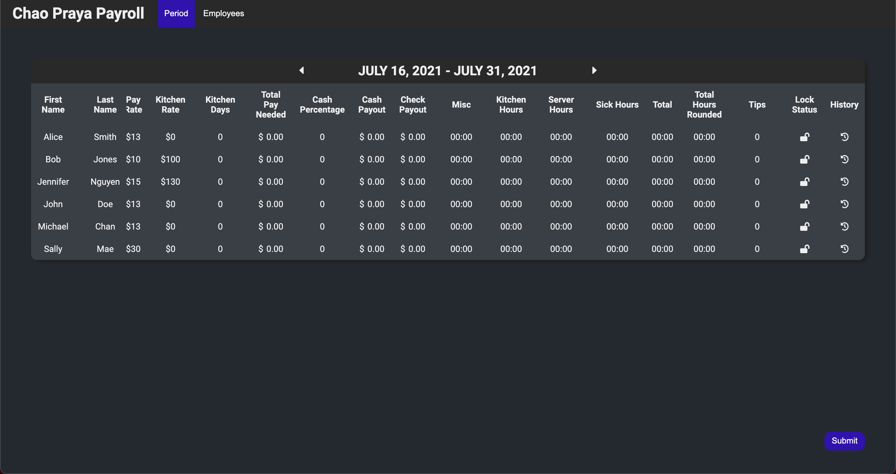
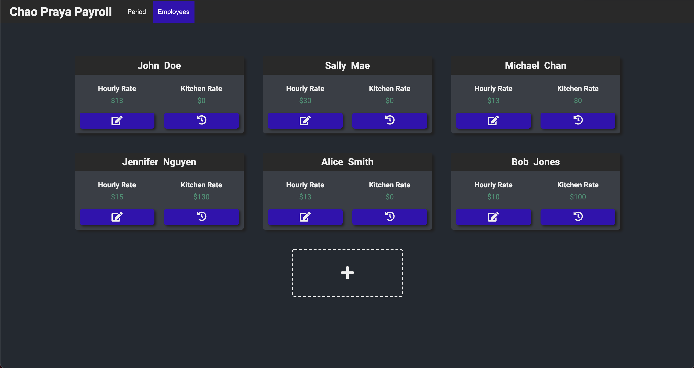
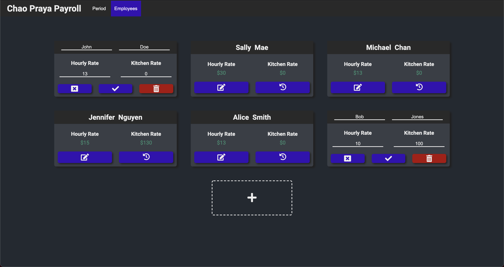
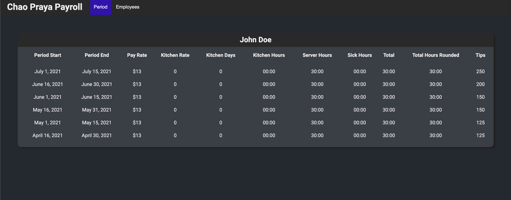

# Payroll

Payroll is a web application for a restaurant to compute bi-weekly payroll and edit employee data

# Tech and Frameworks used

- React
- Redux
- Node.js
- Axios
- SASS

# Functional Requirements

- User can edit current payroll period data
- User can view previous payroll period data
- User can view payroll period history of individual employee
- User can add new employees to the current payroll period
- User can delete employees from payroll
- User can edit employee name, hourly rate, and kitchen rate
- User can preview a pdf document of the payroll data before submission
- User can download the pdf document to their local computer
- User can submit current period data

# Preview Pics

- Period Page
  

- Employees Page
  

- Editable Employee Card
  

- Individual Period History
  
